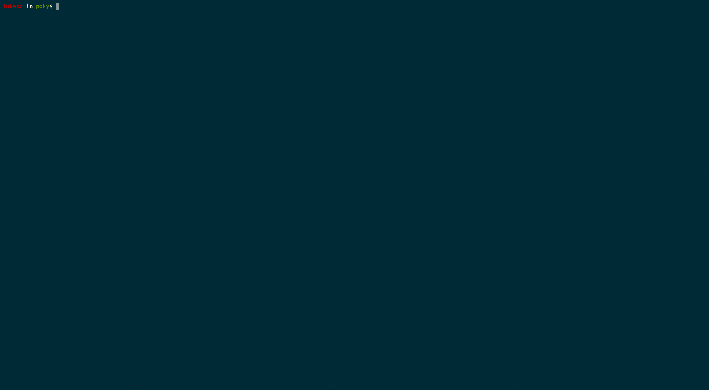

# bitbake-completion

Bitbake bash completion scripts compatible with version 1.39.1,
and with Yocto 2.5 (sumo) release.

# How to use it ?

- Just copy the "bitbake_completion" file to /etc/bash_completion.d:

`
$ cp bitbake_completion /etc/bash_completion.d/
`

- or source file

`
$ source bitbake_completion
`

# Available completion files:
- bitbake,
- bitbake-diffsigs,
- bitbake-dumpsig,
- bitbake-layers,
- bitbake-prserv,
- bitbake-selftest.

# How does it work ?

It will create 2 hidden files with using `$ bitbake -s` in the build directory
on the first execution:
 
.bb_recipes - file with cache of available bitbake recipes
.bb_layers_conf.md5 - bblayers.conf md5 checksum file

It will create a new cache of available bitbake recipes in the 
following situations:

1. When updating the bblayers.conf file.
2. When running bitbake <TAB> for the first time.

# TODO list:
- [x] bash bitbake completion latest release 1.39.0 (yocto - sumo 2.5)
- [ ] create bash completion for other yocto tools (e.g *bitbake-layers*, *bitbake-diffsigs*)
- [ ] support older branches
- [ ] support for zsh completion

## Contributing and reporting bugs

Please send any bug report, pull requests, patches, comments or questions 
to Łukasz Gardoń <lukasz.gardon@gmail.com>.

## Maintainer
Łukasz Gardoń <lukaszgardon555@gmail.com>

###### Project Forked from
Sergio Prado <sergio.prado@e-labworks.com>

https://github.com/sergioprado/bitbake-bash-completion
